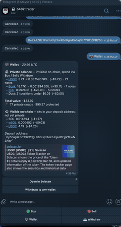

# stealth-trader

**MCP server + Telegram bot for agent-controllable private trading on Solana.** Drive it from Claude Code, Cursor, or any MCP runtime — your wallet never appears in the swap tx, the leader's block, or anyone's wallet tracker.

Built on the [b402 shielded pool](https://github.com/mmchougule/b402-solana) — same primitive that has processed **$800M+ in volume on Base**, now live on Solana mainnet (program `42a3hsCXtQLWonyxWZosaaCJCweYYKMrvNd25p1Jrt2y`). Shield SOL once. After that, every action — buy, copy a leader, lend, cash out — is signed by a relayer over zero-knowledge proofs.

[Quickstart](#try-it-in-30-seconds) · [What an agent sees](#what-an-agent-sees) · [What it does](#what-it-does) · [MCP tools](#mcp-tools) · [How it works](#how-it-works) · [Security](SECURITY.md)

    

<table>
  <tr>
    <td align="center" valign="top" width="60%">
      <br/>
      <sub><b>Terminal:</b> <code>pnpm smoke</code> — real mainnet shield → swap → cashout in ~25 seconds. Prints Solscan links so you can verify the depositor wallet is absent from <code>tx.accountKeys</code>.</sub>
    </td>
    <td align="center" valign="top" width="40%">
      <br/>
      <sub><b>Telegram:</b> buy a token, tap "Verify privacy", bot prints the on-chain <code>accountKeys</code> alongside your derived spending key — proves your wallet is NOT in the swap tx. <a href="https://github.com/mmchougule/stealth-trader/releases/download/v0.4.0/stealth-trader-demo-1.mp4">Full MP4</a>.</sub>
    </td>
  </tr>
</table>

## What it does

| feature | what it is | how to use |
|---|---|---|
| **Private swap** | Buy any SPL token through Jupiter. Wallet never signs the swap; relayer does. | TG `/buy <mint>` · MCP `private_buy` · `pnpm smoke` |
| **Stealth copy-trade** | Mirror a Solana leader at N SOL per buy. Your wallet isn't in the leader's block; the follower-set indexers can't tag you. | TG `/follow <wallet> <sol>` · MCP `follow` |
| **Private cashout** | Withdraw shielded balance to any wallet. The recipient has no on-chain edge to your deposit address. | TG `/cashout <addr>` · MCP `cashout` |
| **Leader discovery** | Rank candidate wallets by 7-day on-chain PnL + buy activity — agent-callable. | TG `/discover` · MCP `discover_leaders` |
| **Private holdings** | Per-mint shielded balance — only the viewing key holder can read it. | TG `/holdings` · MCP `get_holdings` |
| **Private lend** | Earn yield by depositing shielded USDC into Kamino V2. Deposit address absent on chain. | MCP `private_lend` (mainnet) |
| **Leader stats** | 7-day PnL, hit rate, avg position size, top mints for any wallet. | TG `/leader <wallet>` |

All seven exposed as MCP tools so an agent can compose them: *"Discover top 5 wallets, follow each at 0.005 SOL, alert me when shielded USDC clears $500."* That single prompt → 5+ tool calls → bot executes privately end-to-end. No wallet attribution, no follower-set leak, no MEV-bot bait.

## Why it matters

Every public DeFi trade leaks three things: which trades are yours (sandwich bots front-run them), what your portfolio looks like (anyone with your address can see), and when you cash out (counterparties pre-position). The cost is real and measurable — MEV extraction on Solana ran into the tens of millions in 2025.

stealth-trader closes all three by making the signing wallet on the trade NOT your wallet. Verifiable in 30 seconds on Solscan for any tx the bot produces — the depositor's address simply does not appear in `tx.accountKeys`.

## Try it in 30 seconds

```bash
git clone https://github.com/mmchougule/stealth-trader && cd stealth-trader
pnpm install
export HELIUS_RPC_URL="https://mainnet.helius-rpc.com/?api-key=YOUR_KEY"
pnpm smoke
```

**Try it before any Telegram setup** — the smoke only needs a Helius key, runs against real mainnet in ~25 seconds, and proves the privacy property end-to-end.

Here's exactly what happens, no surprises:

1. Generates a `MASTER_SEED` into `./.env` (back this up if you keep using it)
2. Derives a test wallet from that seed
3. **Transfers 0.0045 SOL from your Solana CLI wallet** (`~/.config/solana/id.json`) to the test wallet. The script previews this with a 5-second Ctrl-C window. Opt out: `STEALTH_NO_AUTOFUND=1` + fund the printed address manually.
4. Shields 0.0015 SOL into the b402 pool. *Your test wallet signs this — the one on-chain step where you're visible.*
5. Swaps shielded SOL → USDC. *Relayer signs; your wallet isn't in the swap tx.*
6. Cashes the USDC out — back to your CLI wallet by default. *Relayer signs; your wallet isn't in the cashout tx either.*

The script prints two Solscan links. Open both: the test wallet address doesn't appear in `accountKeys` for the swap or the cashout. That's the privacy property, verifiable on chain. ([How it works on-chain →](https://docs.b402.ai/solana/concepts/privacy-model))

**Net cost: ~$0.01** in tx fees + a few cents of swap slippage. The 0.0015 SOL becomes ~0.13 USDC and comes back to your CLI wallet at the cashout — nothing is drained.

No Solana CLI keypair? The script prints the deposit address and waits 5 minutes for you to fund it manually.

## What an agent sees

Wire stealth-trader into your MCP runtime once:

```bash
claude mcp add stealth-trader -- npx -y @b402ai/stealth-trader@latest mcp
```

Now your agent has 9 tools. A single prompt composes them:

> *"Find the 5 best-performing Solana memecoin wallets this week and follow each at 0.005 SOL per buy — but use the private path so nobody sees I'm the follower."*

The agent calls `discover_leaders` to score candidates, then `follow` × 5. Every mirrored buy after that lands as a shielded note signed by the relayer. The follower's wallet never appears in the leader's block. Same agent can later call `get_holdings`, `private_buy`, or `cashout` — composable, no extra setup.

## Use cases

| audience | how they use it | result |
|---|---|---|
| **Solana trader** (Telegram) | `/follow <wallet> 0.005` to mirror a leader; `/cashout <addr>` to a fresh wallet when done | mirrored trades land shielded; cashout has no on-chain link to the deposit |
| **AI agent** (MCP) | One prompt composes `discover_leaders` → `follow` → `get_holdings` → `cashout` | agent runs a private DeFi strategy with no wallet attribution |
| **App developer** (TypeScript SDK) | `import { B402Solana } from '@b402ai/solana'` and drive the same primitives directly | embed private execution into your own product |

Same code, three surfaces.

## Install

**As an MCP server (Claude Code, Cursor, any MCP runtime):**

```bash
claude mcp add stealth-trader -- npx -y @b402ai/stealth-trader@latest mcp
```

Env: `STEALTH_TG_ID`, `MASTER_SEED`, `HELIUS_RPC_URL`. Data persists to a local pglite store at `~/.stealth-trader/db` — set `DATABASE_URL=postgresql://…` to point at a real cluster.

For more MCP-side wiring (Claude Code, Cursor configs, prompt patterns): [b402 MCP overview →](https://docs.b402.ai/solana/mcp/overview).

**As a self-hosted Telegram bot:**

```bash
git clone https://github.com/mmchougule/stealth-trader && cd stealth-trader
pnpm install
pnpm setup                       # paste bot token + Helius key
pnpm start                       # schema auto-applies on first boot
```

Get a bot token from [@BotFather](https://t.me/botfather) and a free Helius key from [dev.helius.dev](https://dev.helius.dev). The bot ships with pglite (WASM Postgres) in-process, so the only thing you need to provision is the bot itself.

For production deployments, set `OPERATOR_FEE_KEYPAIR_PATH` to a keypair file with ~0.05 SOL on hand. It absorbs the one-time ~0.002 SOL rent per (recipient, mint) on `/cashout` so users never see "insufficient funds for rent" the first time they withdraw to a fresh address.

## Usage (Telegram)

```
/start                            tap-to-follow chips + your deposit address
/wallet                           your deposit address (where to send SOL)
/balance                          public SOL balance you can spend

/buy <mint>                       open the Buy panel:
                                    Private balance → spend an existing shielded note
                                    Public balance  → shield fresh SOL and swap
                                    Each path is a guaranteed-spendable button.

/sell <mint>                      open the Sell panel — pick a shielded note to sell
/holdings                         per-mint shielded balances + dust summary

/follow <wallet> <sol>            mirror every buy from a leader privately
/follows                          list active follows
/unfollow <wallet>                stop mirroring

/leader <wallet>                  7-day stats — PnL, hit rate, top mints
/discover                         top vetted leaders, tap to follow

/cashout <recipient>              unshield to any wallet (no link to deposit)
```

## MCP tools

All operations exposed as MCP tools so agents (Claude Code, Cursor, custom) can compose them. Example prompt the agent can act on directly: *"Find the 5 wallets that made the most on memecoins this week and follow each at 0.005 SOL — but use the private path so nobody sees I'm the follower."* The agent calls `discover_leaders`, then `follow` five times.

| tool                  | what it does                                                          |
|-----------------------|------------------------------------------------------------------------|
| `private_buy`         | swap SOL → any SPL token through the shielded pool                    |
| `private_lend`        | lend a shielded token into Kamino (mainnet only; v0.4 — upstream relayer fix pending) |
| `cashout`             | unshield to a recipient with no on-chain link to your deposit         |
| `get_holdings`        | shielded token balances per mint                                      |
| `get_wallet`          | your deposit address (where you shield SOL once)                      |
| `get_balance`         | public SOL balance available for new shields                          |
| `follow`              | mirror a leader at N SOL per buy, private path                        |
| `unfollow`            | stop mirroring                                                        |
| `list_follows`        | active follows                                                        |
| `discover_leaders`    | rank candidate wallets by recent on-chain PnL + activity              |

## How it works

```
Your wallet  ─shield once──►  shielded note (yours, hidden balance + owner)
                                       │
                ┌──────────────────────┼──────────────────────┐
                ▼                      ▼                      ▼
          private_buy            stealth copy           private_lend
          (Jupiter swap)         (follow leader)        (Kamino, v0.4)
                │                      │                      │
                └──────────┬───────────┴──────────┬───────────┘
                           ▼                      ▼
                  b402 relayer signs        new shielded note
                  the on-chain tx           (yours, still hidden)
```

Every action after the initial shield is built as an adapt proof: input is one of your shielded notes, output is a new shielded note, signer is the b402 relayer. The on-chain tx shows the relayer paying from a pool-controlled account. Your wallet is not a signer, not an account, not in the block.

Deeper reading on the b402 docs site:
- [Privacy model](https://docs.b402.ai/solana/concepts/privacy-model) — exactly what's hidden, what's revealed
- [Trust assumptions](https://docs.b402.ai/solana/concepts/trust-assumptions) — what the relayer can and can't do
- [Protocol architecture](https://docs.b402.ai/solana/protocol/architecture) — circuits, nullifier tree, verifier
- [Adapter overview](https://docs.b402.ai/solana/adapters/overview) — how Jupiter/Kamino integrate

Two correctness properties worth knowing — both ship in `@b402ai/solana@0.0.33`:
- **Amounts come from on-chain transfer arrays, not Helius's `events.swap` enrichment.** Helius mis-reports `nativeInput.amount` for some Jupiter-routed pump.fun trades (priority-fee leg instead of main wSOL leg). The copy-trade parser sums native + wSOL transfers out of the leader's address — ground truth.
- **Note leafIndex comes from the pool's `CommitmentAppended` event log, not the pre-tx `tree.leafCount` prediction.** Concurrent shields on the shared pool race the prediction. Reading the post-confirm event eliminates the phantom-note class that produces silent `Adapt_221` proof failures.

## Compared to

vs. public DEX routers (Jupiter, Raydium UI, etc.):

| property                                       | stealth-trader | public router |
|------------------------------------------------|:--------------:|:-------------:|
| your wallet signs the swap?                    | no             | yes           |
| your wallet appears in `tx.accountKeys`?       | no             | yes           |
| your portfolio is readable from your address?  | no             | yes           |
| MEV bots can target your trade?                | no             | yes           |

vs. copy-trade bots (Trojan, BullX, Photon, Maestro):

| property                                          | stealth-trader | Trojan / BullX / Photon |
|---------------------------------------------------|:--------------:|:-----------------------:|
| follower's wallet appears in the leader's block?  | no             | yes                     |
| MCP-callable (any agent runtime)?                 | yes            | no                      |
| open source?                                      | yes            | no                      |

The "wallet in accountKeys" rows are facts checkable on Solscan in 30 seconds for any tx those tools produce.

## Numbers

- 144 unit tests covering parse-swap, dust filter, copy orchestrator, webhook reconciler, per-user serial lock, balance ledger, wallet derivation, deposits, MCP handlers.
- Zero network calls in the test suite — ~250ms wall time.
- Built on `@b402ai/solana@0.0.33`, mainnet program `42a3hsCXtQLWonyxWZosaaCJCweYYKMrvNd25p1Jrt2y`.

## Status

v0.3 — Telegram surface + MCP server wired against `@b402ai/solana`. All commands hit real SDK calls: `/follow`-triggered copies dispatch `sdk.swap`, `/holdings` reads the shielded NoteStore (Postgres-backed for cold-boot durability), `/cashout` calls `sdk.unshield` to deliver native SOL to a fresh address with no on-chain link to the depositor.

## Limits

- Copy-trade is buys only. Sells (leader sells X → follower sells X) ship in v0.4.
- Hosted b402 relayer is the default. Run your own from [`mmchougule/b402-solana/packages/relayer`](https://github.com/mmchougule/b402-solana/tree/main/packages/relayer) and point `B402_RELAYER_URL` at it.
- The b402 shielded pool is unaudited. Read the [trust assumptions](https://docs.b402.ai/solana/concepts/trust-assumptions) before depositing more than you'd lose in an experiment.
- Same-amount notes pile up if every copy uses identical `per_trade_lamports`. The SDK recycles existing notes when shapes match. Snap-to-nearest recycle is on the roadmap.

## Security

Reports: see [SECURITY.md](SECURITY.md). 90-day coordinated disclosure.

## Stack

- [`@b402ai/solana`](https://www.npmjs.com/package/@b402ai/solana) — shielded pool SDK
- [`@modelcontextprotocol/sdk`](https://github.com/modelcontextprotocol/typescript-sdk) — MCP transport
- [`grammy`](https://github.com/grammyjs/grammY) — Telegram bot framework
- [`zod`](https://github.com/colinhacks/zod) — MCP tool schema validation
- [`pino`](https://github.com/pinojs/pino) — structured logging
- [`pg`](https://github.com/brianc/node-postgres) — Postgres driver
- Helius enhanced webhooks for leader-tx ingestion

## License

Apache-2.0.
